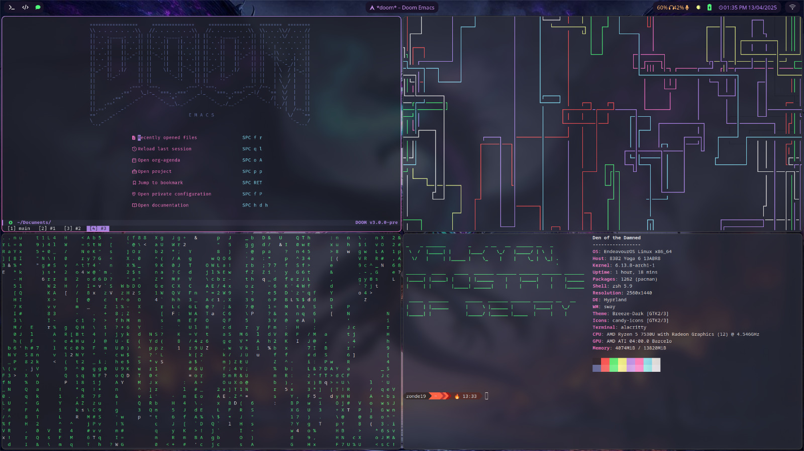

#+TITLE: Installing EndeavourOS with Hyprland and KDE Plasma: A Beginner's Guide
#+AUTHOR: zParik
#+DATE: [2025-04-13 Sun]

#+OPTIONS: toc:3 num:3

#+EXPORT_FILE_NAME: endeavouros-hyprland-kde

#+SETUPFILE: https://fniessen.github.io/org-html-themes/org/theme-readtheorg.setup

#+HTML_HEAD: 

#+LANGUAGE: en

#+caption: My hyprland setup :3

* Introduction

Welcome to the world of Linux! This guide is designed specifically for newcomers to Linux who want to explore a customizable and powerful operating system. EndeavourOS is an excellent starting point for beginners because it simplifies the installation process while providing access to the vast capabilities of Arch Linux.

In simple terms, EndeavourOS is a user-friendly version of Arch Linux, which is known for its flexibility and customization options. This guide will walk you through installing EndeavourOS and setting it up with two complementary interfaces:

1. KDE Plasma: A full-featured desktop environment similar to Windows or macOS in its comprehensive functionality
2. Hyprland: A modern window management system that automatically arranges your applications in an efficient manner

** What are Desktop Environments and Window Managers?

For those new to Linux, it's important to understand two key concepts:

- *Desktop Environment*: This is the complete graphical interface you interact with, including the desktop, application menus, system settings, and built-in applications. KDE Plasma is one of the most feature-rich desktop environments available.

- *Window Manager*: This component controls how individual application windows appear and behave on your screen. Hyprland is a special type called a "tiling window manager" that automatically arranges windows in a space-efficient way without overlapping.

** Why EndeavourOS for Beginners?

EndeavourOS offers several advantages for Linux newcomers:

- Simplified installation process compared to traditional Arch Linux
- "Rolling release" model, meaning you receive continuous updates rather than major version upgrades
- Helpful and active community that welcomes beginners
- Minimal unnecessary software while maintaining user-friendliness
- Access to the Arch User Repository (AUR), an extensive collection of additional software

* Prerequisites

Before beginning the installation, please ensure you have:

- A USB drive with at least 4GB storage capacity
- A backup of any important data (if installing on a computer with existing data)
- A computer with at least 4GB of RAM (8GB recommended)
- Approximately 20GB of free disk space (more is better)
- A stable internet connection for downloading the installation files and updates

* Understanding Linux Terminology for Beginners

Before proceeding, let's clarify some common Linux terms you'll encounter throughout this guide:

** Basic Linux Concepts

- *Distribution (Distro)*: A specific version of Linux packaged with particular software and configuration. EndeavourOS is a distribution based on Arch Linux.

- *Terminal/Console*: The command-line interface where you can type text commands. Don't worry—this guide will explain any commands you need to use.

- *Package Manager*: Software that handles installing, updating, and removing applications. EndeavourOS uses "pacman" as its package manager.

- *Repository*: A collection of software packages available for installation through the package manager.

- *AUR (Arch User Repository)*: A community-driven repository containing package descriptions that allow you to compile and install additional software.

- *Wayland/X11*: Display server protocols that handle the communication between your applications and your display. Hyprland uses Wayland, which is more modern.

* Downloading and Creating Installation Media

** Step 1: Download the EndeavourOS ISO

1. Visit the official EndeavourOS website at https://endeavouros.com/
2. Navigate to the "Download" section
3. Download the latest ISO file (approximately 2GB)

** Step 2: Create a Bootable USB Drive

There are several user-friendly tools to create a bootable USB drive:

*** For Windows Users:
1. Download and install Rufus or Balena Etcher
2. Launch the application
3. Select the downloaded EndeavourOS ISO file
4. Select your USB drive (Warning: All data on the drive will be erased)
5. Click "Start" or "Flash" and wait for the process to complete

*** For macOS Users:
1. Download and install Balena Etcher
2. Launch Etcher
3. Select the downloaded EndeavourOS ISO file
4. Select your USB drive
5. Click "Flash" and wait for the process to complete

*** For Linux Users:
If you're already using Linux on another system, you can use the 'dd' command or Balena Etcher.

* Installing EndeavourOS

** Step 1: Boot from the USB Drive

1. Insert the USB drive into your computer
2. Restart your computer
3. Access the boot menu (typically by pressing F12, F10, or Esc during startup—this varies by manufacturer)
4. Select your USB drive from the boot menu
5. When the EndeavourOS boot menu appears, select "Boot EndeavourOS Live"

** Step 2: Connect to the Internet

Once the live environment loads:

1. Click on the network icon in the system tray (bottom right)
2. Select your Wi-Fi network and enter the password
3. Wait for the connection to establish

** Step 3: Launch the Installer

1. On the welcome screen, click "Start the Installer"
2. Select "Online" installation mode for more options

** Step 4: Follow the Installation Wizard

The installer will guide you through several steps:

1. *Language Selection*: Choose your preferred language
2. *Location*: Select your region and timezone
3. *Keyboard Layout*: Choose your keyboard configuration
4. *Partitioning*:
   - For beginners, the "Erase disk" option is simplest (Warning: This will delete all existing data)
   - If you want to dual-boot with another operating system, consider seeking additional guidance as this requires more advanced partitioning

5. *User Account*:
   - Create your user name
   - Enter your full name (optional)
   - Create a strong password
   - Create a separate root password or use the same password (using the same is fine for personal computers)

6. *Desktop Selection*:
   - Choose "KDE Plasma" from the desktop environment options
   - We will install Hyprland separately after the initial setup

7. *Review*: Confirm your selections
8. *Installation*: Click "Install" and confirm the warning about data deletion
9. Wait for the installation to complete (typically 15-30 minutes depending on your internet speed)
10. When prompted, click "Restart Now"

** Step 5: First Boot

1. Remove the USB drive when prompted
2. The system will restart and boot into your new EndeavourOS installation
3. Log in using the username and password you created during installation

* Basic System Navigation

Now that you've installed EndeavourOS with KDE Plasma, let's go over some basics:

** KDE Plasma Interface

The KDE Plasma interface includes:

- *Application Menu*: Similar to the Start menu in Windows, found in the bottom left
- *System Tray*: Icons for network, volume, battery, etc. in the bottom right
- *Desktop*: The main workspace where you can place files and shortcuts
- *File Manager*: Called "Dolphin" in KDE, allows you to browse your files graphically
- *System Settings*: Comprehensive control panel for customizing your system

** Basic Terminal Commands

While KDE Plasma provides a graphical interface for most tasks, understanding some basic terminal commands is useful:

1. Open the terminal by pressing Alt+F2 and typing "konsole" or finding it in the application menu
2. Some essential commands:
   - `ls`: List files in the current directory
   - `cd [directory]`: Change to the specified directory
   - `sudo [command]`: Run a command with administrator privileges
   - `pacman -Syu`: Update your system
   - `clear`: Clear the terminal screen

* Installing and Setting Up Neovim

As we'll be using Neovim throughout this guide, let's take a moment to properly install and configure it for an optimal experience:

** Step 1: Install Neovim

1. Open a terminal and run:

#+begin_src sh
sudo pacman -S neovim
#+end_src

** Step 2: Basic Neovim Commands for Beginners

Neovim is a powerful text editor that operates in different modes:

- *Normal mode*: The default mode for navigation and commands
- *Insert mode*: For typing text (enter with `i`, exit with `Esc`)
- *Visual mode*: For selecting text (enter with `v`, exit with `Esc`)
- *Command mode*: For executing commands (enter with `:`, execute with `Enter`)

Essential commands to know:

1. *Navigation*:
   - Arrow keys work for basic movement
   - `h` (left), `j` (down), `k` (up), `l` (right) for movement
   - `w` to move forward by word, `b` to move backward by word
   - `0` to move to the beginning of a line, `$` to move to the end

2. *Editing*:
   - `i` to enter insert mode at the cursor
   - `a` to enter insert mode after the cursor
   - `o` to create a new line below and enter insert mode
   - `x` to delete a character
   - `dd` to delete a line
   - `yy` to copy a line (yank)
   - `p` to paste

3. *Saving and Exiting*:
   - `:w` to save (write)
   - `:q` to quit
   - `:wq` to save and quit
   - `:q!` to quit without saving

** Step 3: Create a Basic Neovim Configuration

For a better editing experience, create a simple configuration:

1. Create the Neovim configuration directory:

#+begin_src sh
mkdir -p ~/.config/nvim
#+end_src

2. Create the init.vim file:

#+begin_src sh
nvim ~/.config/nvim/init.vim
#+end_src

3. Add the following basic configuration (press `i` to enter insert mode):

#+begin_src vim
" Basic Settings
set number          " Show line numbers
set relativenumber  " Show relative line numbers
set expandtab       " Use spaces instead of tabs
set tabstop=4       " Tab width
set shiftwidth=4    " Indentation width
set softtabstop=4   " Number of spaces per tab
set autoindent      " Auto indent
set smartindent     " Smart indent
set wrap            " Wrap lines
set linebreak       " Break lines at words
set scrolloff=8     " Start scrolling 8 lines from the top/bottom
set sidescrolloff=8 " Start scrolling 8 characters from the left/right
set cursorline      " Highlight current line
set showmatch       " Show matching brackets
set incsearch       " Incremental search
set hlsearch        " Highlight search results
set ignorecase      " Ignore case in search
set smartcase       " Override ignore case if search contains uppercase

" Better split navigation
nnoremap <C-J> <C-W><C-J>
nnoremap <C-K> <C-W><C-K>
nnoremap <C-L> <C-W><C-L>
nnoremap <C-H> <C-W><C-H>

" Set leader key to space
let mapleader = " "

" Faster save and quit
nnoremap <leader>w :w<CR>
nnoremap <leader>q :q<CR>
nnoremap <leader>x :x<CR>

" Enable syntax highlighting
syntax enable
#+end_src

4. Save the file by pressing `Esc` to exit insert mode, then typing `:wq` and pressing Enter

This simple configuration provides a good starting point for a more comfortable Neovim experience. As you become more familiar with Neovim, you can explore more advanced features and plugins.

* Installing Hyprland

Now let's install Hyprland alongside KDE Plasma:

** Step 1: Update Your System

1. Open Konsole (the terminal application)
2. Enter the following command:

#+begin_src sh
sudo pacman -Syu
#+end_src

3. Enter your password when prompted
4. Type 'y' to confirm the update
5. Wait for the system update to complete

** Step 2: Install Yay (AUR Helper)

EndeavourOS comes with "yay" pre-installed, but if for some reason it's not available, you can install it with:

#+begin_src sh
sudo pacman -S --needed git base-devel
git clone https://aur.archlinux.org/yay.git
cd yay
makepkg -si
#+end_src

** Step 3: Install Hyprland and Required Packages

1. Now we'll install Hyprland from the AUR to get the latest version, along with other required packages:

#+begin_src sh
yay -S hyprland-git waybar-hyprland-git kitty wofi grim slurp wl-clipboard polkit-kde-agent qt5-wayland qt6-wayland
#+end_src

2. Type 'y' to confirm installation
3. Wait for the installation to complete

** Step 4: Set Up Notification Management

Proper notification handling is essential for a complete desktop experience. Let's install a notification daemon:

1. Install SwayNotificationCenter (SwayNC), a feature-rich notification center:

#+begin_src sh
yay -S swaync
#+end_src

Alternatively, you can install Dunst for a more minimal approach:

#+begin_src sh
yay -S dunst
#+end_src

2. Make sure your notification daemon starts with Hyprland by adding it to your configuration (we'll set this up in the next step)

** Step 5: Create a Basic Hyprland Configuration

1. Create the configuration directory:

#+begin_src sh
mkdir -p ~/.config/hypr
#+end_src

2. Create the configuration file using Neovim:

#+begin_src sh
nvim ~/.config/hypr/hyprland.conf
#+end_src

3. Add the following basic configuration (press `i` to enter insert mode in Neovim):

#+begin_src conf
# Monitor configuration
monitor=,preferred,auto,1

# Execute applications at launch
exec-once = waybar
exec-once = swaync
exec-once = nm-applet
exec-once = /usr/lib/polkit-kde-authentication-agent-1

# Set applications
$terminal = kitty
$fileManager = dolphin
$menu = wofi --show drun
$browser = firefox

# Some default env vars
env = XCURSOR_SIZE,24
env = QT_QPA_PLATFORM,wayland
env = QT_QPA_PLATFORMTHEME,qt6ct
env = QT_WAYLAND_DISABLE_WINDOWDECORATION,1
env = QT_AUTO_SCREEN_SCALE_FACTOR,1

# Input configuration
input {
    kb_layout = us
    follow_mouse = 1
    sensitivity = 0 # -1.0 - 1.0, 0 means no modification
    touchpad {
        natural_scroll = false
    }
}

# General window layout and colors
general {
    gaps_in = 5
    gaps_out = 10
    border_size = 2
    col.active_border = rgba(33ccffee) rgba(bd93f9ff) 45deg
    col.inactive_border = rgba(595959aa)
    layout = dwindle

    # Please see wiki before enabling
    allow_tearing = false
}

# Decoration settings
decoration {
    rounding = 10

    # Add transparency to windows
    active_opacity = 1.0
    inactive_opacity = 1.0

    blur {
        enabled = true
        size = 3
        passes = 2
    }

    shadow {
        enabled = true
        size = 3
        offset = 1 1
    }
}

# Animation settings
animations {
    enabled = yes

    bezier = myBezier, 0.05, 0.9, 0.1, 1.05
    bezier = easeOutQuint, 0.23, 1, 0.32, 1

    animation = windows, 1, 7, myBezier
    animation = windowsOut, 1, 7, default, popin 80%
    animation = border, 1, 10, default
    animation = fade, 1, 7, default
    animation = workspaces, 1, 6, default
}

# Layout settings
dwindle {
    pseudotile = yes # master switch for pseudotiling
    preserve_split = yes # you probably want this
}

master {
    new_is_master = true
}

# Window rules
windowrulev2 = opacity 0.9 0.9,class:^(kitty|wofi|thunar)$
windowrulev2 = suppressevent maximize, class:.* # prevents windows from maximizing themselves

# Key bindings
bind = SUPER, Return, exec, $terminal
bind = SUPER, Q, killactive,
bind = SUPER SHIFT, X, exit,
bind = SUPER, E, exec, $fileManager
bind = SUPER, V, togglefloating,
bind = SUPER, R, exec, $menu
bind = SUPER, W, exec, $browser
bind = SUPER, F, fullscreen,
bind = SUPER, P, pseudo,
bind = SUPER, J, togglesplit,

# Move focus with mainMod + arrow keys
bind = SUPER, left, movefocus, l
bind = SUPER, right, movefocus, r
bind = SUPER, up, movefocus, u
bind = SUPER, down, movefocus, d

# Move windows with mainMod + SHIFT + arrow keys
bind = SUPER SHIFT, left, movewindow, l
bind = SUPER SHIFT, right, movewindow, r
bind = SUPER SHIFT, up, movewindow, u
bind = SUPER SHIFT, down, movewindow, d

# Switch workspaces with mainMod + [0-9]
bind = SUPER, 1, workspace, 1
bind = SUPER, 2, workspace, 2
bind = SUPER, 3, workspace, 3
bind = SUPER, 4, workspace, 4
bind = SUPER, 5, workspace, 5
bind = SUPER, 6, workspace, 6
bind = SUPER, 7, workspace, 7
bind = SUPER, 8, workspace, 8
bind = SUPER, 9, workspace, 9
bind = SUPER, 0, workspace, 10

# Move active window to a workspace with mainMod + SHIFT + [0-9]
bind = SUPER SHIFT, 1, movetoworkspace, 1
bind = SUPER SHIFT, 2, movetoworkspace, 2
bind = SUPER SHIFT, 3, movetoworkspace, 3
bind = SUPER SHIFT, 4, movetoworkspace, 4
bind = SUPER SHIFT, 5, movetoworkspace, 5
bind = SUPER SHIFT, 6, movetoworkspace, 6
bind = SUPER SHIFT, 7, movetoworkspace, 7
bind = SUPER SHIFT, 8, movetoworkspace, 8
bind = SUPER SHIFT, 9, movetoworkspace, 9
bind = SUPER SHIFT, 0, movetoworkspace, 10

# Special workspace (scratchpad)
bind = SUPER, S, togglespecialworkspace, magic
bind = SUPER SHIFT, S, movetoworkspace, special:magic

# Scroll through existing workspaces with mainMod + scroll
bind = SUPER, mouse_down, workspace, e+1
bind = SUPER, mouse_up, workspace, e-1

# Move/resize windows with mainMod + LMB/RMB and dragging
bindm = SUPER, mouse:272, movewindow
bindm = SUPER, mouse:273, resizewindow

# Screenshot binding
bind = , Print, exec, grim -g "$(slurp)" ~/Pictures/Screenshots/$(date +%Y-%m-%d_%H-%M-%S).png
#+end_src

4. Save the file by pressing `Esc` to exit insert mode, then typing `:wq` and pressing Enter

** Step 6: Configure SwayNC (Notification Center)

If you chose to install SwayNC, you'll need to create a basic configuration:

1. Create the configuration directory:

#+begin_src sh
mkdir -p ~/.config/swaync
#+end_src

2. Create the configuration file using Neovim:

#+begin_src sh
nvim ~/.config/swaync/config.json
#+end_src

3. Add the following basic configuration (press `i` to enter insert mode):

#+begin_src json
{
  "$schema": "/etc/xdg/swaync/configSchema.json",
  "positionX": "right",
  "positionY": "top",
  "control-center-margin-top": 10,
  "control-center-margin-bottom": 10,
  "control-center-margin-right": 10,
  "control-center-margin-left": 10,
  "notification-icon-size": 64,
  "notification-body-image-height": 100,
  "notification-body-image-width": 200,
  "timeout": 10,
  "timeout-low": 5,
  "timeout-critical": 0,
  "fit-to-screen": true,
  "control-center-width": 500,
  "control-center-height": 600,
  "notification-window-width": 500,
  "keyboard-shortcuts": true,
  "image-visibility": "when-available",
  "transition-time": 200,
  "hide-on-clear": true,
  "hide-on-action": true,
  "script-fail-notify": true
}
#+end_src

4. Save the file by pressing `Esc` to exit insert mode, then typing `:wq` and pressing Enter

5. Create a style file:

#+begin_src sh
nvim ~/.config/swaync/style.css
#+end_src

6. Add the following basic style (press `i` to enter insert mode):

#+begin_src css
​* {
  all: unset;
  font-family: "JetBrains Mono", "Font Awesome 5 Free";
  font-size: 14px;
}

.notification-row {
  outline: none;
}

.notification {
  margin: 6px;
  padding: 10px;
  border-radius: 12px;
  background-color: #1e1e2e;
  border: 2px solid #313244;
}

.notification-content {
  padding: 10px;
  color: #cdd6f4;
}

.notification-default-action,
.notification-action {
  padding: 5px;
  margin: 5px;
  border-radius: 6px;
  background-color: #313244;
  color: #cdd6f4;
}

.close-button {
  background-color: #f38ba8;
  color: #1e1e2e;
  border-radius: 6px;
  margin: 5px;
}

.notification-default-action:hover,
.notification-action:hover {
  background-color: #45475a;
}

.close-button:hover {
  background-color: #f5c2e7;
}

.notification-body {
  padding: 5px;
}

.control-center {
  background-color: #1e1e2e;
  border-radius: 12px;
  border: 2px solid #313244;
  margin: 10px;
  padding: 10px;
}

.control-center-list {
  background-color: transparent;
}

.floating-notifications {
  background-color: transparent;
}
#+end_src

7. Save the file by pressing `Esc` to exit insert mode, then typing `:wq` and pressing Enter

** Step 7: Configure Waybar

1. Create the Waybar configuration directory:

#+begin_src sh
mkdir -p ~/.config/waybar
#+end_src

2. Create the configuration file using Neovim:

#+begin_src sh
nvim ~/.config/waybar/config
#+end_src

3. Add the following basic configuration (press `i` to enter insert mode):

#+begin_src json
{
    "layer": "top",
    "position": "top",
    "height": 30,
    "spacing": 4,
    "modules-left": ["hyprland/workspaces"],
    "modules-center": ["hyprland/window"],
    "modules-right": ["tray", "network", "pulseaudio", "cpu", "memory", "temperature", "battery", "clock"],

    "hyprland/workspaces": {
        "format": "{icon}",
        "on-click": "activate",
        "format-icons": {
            "1": "1",
            "2": "2",
            "3": "3",
            "4": "4",
            "5": "5",
            "6": "6",
            "7": "7",
            "8": "8",
            "9": "9",
            "10": "10"
        },
        "sort-by-number": true
    },

    "hyprland/window": {
        "format": "{}",
        "max-length": 50
    },

    "tray": {
        "spacing": 10,
        "icon-size": 16
    },

    "clock": {
        "format": "{:%I:%M %p}",
        "format-alt": "{:%Y-%m-%d}",
        "tooltip-format": "<big>{:%Y %B}</big>\n<tt><small>{calendar}</small></tt>"
    },

    "cpu": {
        "format": "{usage}% ",
        "interval": 1,
        "tooltip": true
    },

    "memory": {
        "format": "{}% ",
        "interval": 1
    },

    "temperature": {
        "critical-threshold": 80,
        "format": "{temperatureC}°C {icon}",
        "format-icons": ["", "", ""]
    },

    "battery": {
        "bat": "BAT0",
        "states": {
            "good": 95,
            "warning": 30,
            "critical": 15
        },
        "format": "{capacity}% {icon}",
        "format-charging": "{capacity}% ",
        "format-plugged": "{capacity}% ",
        "format-alt": "{time} {icon}",
        "format-icons": ["", "", "", "", ""]
    },

    "network": {
        "format-wifi": "{essid} ({signalStrength}%) ",
        "format-ethernet": "Connected  ",
        "format-disconnected": "Disconnected ⚠",
        "on-click": "nm-connection-editor",
        "tooltip-format": "{ifname}: {ipaddr}"
    },

    "pulseaudio": {
        "format": "{volume}% {icon}",
        "format-bluetooth": "{volume}% {icon}",
        "format-bluetooth-muted": " {icon}",
        "format-muted": " ",
        "format-icons": {
            "headphone": "",
            "hands-free": "",
            "headset": "",
            "phone": "",
            "portable": "",
            "car": "",
            "default": ["", "", ""]
        },
        "on-click": "pavucontrol"
    }
}
#+end_src

4. Save the file by pressing `Esc` to exit insert mode, then typing `:wq` and pressing Enter

5. Create a style file:

#+begin_src sh
nvim ~/.config/waybar/style.css
#+end_src

6. Add the following custom style featuring a darker, more purple Dracula theme (press `i` to enter insert mode):

#+begin_src css
​* {
  font-family: FantasqueSansMono Nerd Font;
  font-size: 17px;
  min-height: 0;
}
/* Darker, More Purple Dracula Theme */
body {
  background-color: #100d1c; /* Darker with a Deep Purple Hue */
  color: #f8f8f2; /* Foreground */
}
#waybar {
  background: transparent;
  color: #c792ea; /* More Purple */
  margin: 5px 5px;
}
#workspaces {
  background-color: #1a142b; /* Dark Purple */
  border-radius: 1rem;
  margin: 5px;
  margin-left: 1rem;
}
#workspaces button {
  color: #f8f8f2; /* Light Foreground */
  border-radius: 1rem;
  padding: 0.4rem;
}
#workspaces button.active {
  color: #50fa7b; /* Bright Neon Purple */
  -webkit-filter: grayscale(100%) blur(3px) brightness(120%);
  border-radius: 1rem;
}
#workspaces button:hover {
  color: #c792ea; /* Softer Purple */
  border-radius: 1rem;
}
#custom-music,
#tray,
#window,
#backlight,
#clock,
#battery,
#pulseaudio,
#custom-lock,
#custom-power {
  background-color: #1a142b; /* Dark Purple */
  padding: 0.5rem 1rem;
  margin: 5px 0;
}
#clock {
  color: #bb86fc; /* Neon Purple */
  border-radius: 0px 1rem 1rem 0px;
  margin-right: 1rem;
}
#battery {
  color: #50fa7b; /* Green */
}
#battery.charging {
  color: #f1fa8c; /* Yellow */
}
#battery.warning:not(.charging) {
  color: #ff5555; /* Red */
}
#backlight {
  color: #f1fa8c; /* Yellow */
}
#backlight,
#battery {
  border-radius: 0;
}
#pulseaudio {
  color: #ffb86c; /* Orange */
  border-radius: 1rem 0px 0px 1rem;
}
#custom-music {
  color: #bb86fc; /* Neon Purple */
  border-radius: 1rem;
}
#custom-lock {
  border-radius: 1rem 0px 0px 1rem;
  color: #c792ea; /* Soft Purple */
  -webkit-filter: brightness(200%);
}
#custom-power {
  margin-right: 1rem;
  border-radius: 0px 1rem 1rem 0px;
  color: #8be9fd; /* Cyan */
}
#tray {
  margin-right: 1rem;
  color: #50fa7b; /* Green */
  border-radius: 1rem;
}
#window {
  color: #c792ea; /* Soft Purple */
  font-size: 1em;
  border-radius: 1rem;
}
#+end_src

7. Save the file by pressing `Esc` to exit insert mode, then typing `:wq` and pressing Enter

* Switching Between KDE Plasma and Hyprland

Now that you have both environments installed, you can choose which one to use at login:

1. Log out of your current session by clicking on the Application Menu → Leave → Log Out
2. At the login screen, look for a session selection button (usually a small icon near the password field)
3. Click on this button to see available sessions
4. Choose either "Plasma" (for KDE) or "Hyprland"
5. Enter your password and log in

** Understanding the Hyprland Interface

When you first log into Hyprland, you'll notice it's quite different from KDE:

- There is no desktop with icons
- Windows automatically tile and arrange themselves
- You navigate primarily with keyboard shortcuts (listed in the configuration file)
- The top bar (Waybar) shows workspaces and system information

Key shortcuts to remember:
- Super (Windows key) + Enter: Open terminal
- Super + Q: Close active window
- Super + E: Open file manager
- Super + R: Open application launcher
- Super + 1-9: Switch to workspace 1-9
- Super + Arrow keys: Move focus between windows
- Super + Mouse drag: Move or resize windows

* Basic System Maintenance

As a new Linux user, understanding basic maintenance will help keep your system running smoothly:

** Updating Your System

Regularly updating your system is important for security and stability:

1. Open a terminal
2. Run the following command:

#+begin_src sh
sudo pacman -Syu
#+end_src

3. Enter your password when prompted
4. Type 'y' to confirm updates

It's recommended to update at least once a week.

** Installing Additional Software

EndeavourOS uses the pacman package manager to install software:

1. To search for a package:

#+begin_src sh
pacman -Ss package_name
#+end_src

2. To install a package:

#+begin_src sh
sudo pacman -S package_name
#+end_src

3. For software not in the official repositories, you can use the AUR helper 'yay':

#+begin_src sh
yay -S package_name
#+end_src

** Common Issues and Troubleshooting

- *If X doesn't start*: Press Ctrl+Alt+F2 to access a terminal, log in, and troubleshoot
- *If you forget your password*: Boot into recovery mode and reset it
- *If updates break something*: You can downgrade packages with:

#+begin_src sh
sudo pacman -U /var/cache/pacman/pkg/package-old_version.pkg.tar.zst
#+end_src

* Customizing Your Setup

** KDE Plasma Customization

1. Right-click on the desktop and select "Configure Desktop"
2. Access the System Settings for comprehensive customization options
3. Explore themes, widgets, and desktop effects

** Hyprland Customization

1. Edit the configuration file using Neovim:

#+begin_src sh
nvim ~/.config/hypr/hyprland.conf
#+end_src

2. Modify settings according to your preferences
3. Save changes by pressing `Esc` and typing `:wq`, then restart Hyprland (Super + SHIFT + X to exit, then log back in)

* Further Resources for Beginners

As you continue your Linux journey, these resources will be invaluable:

** Documentation and Wikis

- *Arch Wiki*: https://wiki.archlinux.org/ - Comprehensive documentation for Arch-based systems
- *EndeavourOS Wiki*: https://discovery.endeavouros.com/ - Specific guidance for EndeavourOS
- *KDE Documentation*: https://docs.kde.org/ - Official documentation for KDE Plasma
- *Hyprland Wiki*: https://wiki.hyprland.org/ - Official documentation for Hyprland

** Community Support

- *EndeavourOS Forums*: https://forum.endeavouros.com/ - Friendly community for beginners
- *EndeavourOS Reddit*: https://www.reddit.com/r/EndeavourOS/ - Active subreddit for questions
- *Hyprland Discord*: Available through the Hyprland website
- *Arch Linux Forums*: https://bbs.archlinux.org/ - More advanced technical discussions

** Learning Resources

- *Linux Journey*: https://linuxjourney.com/ - Interactive tutorials for beginners
- *The Linux Command Line*: A comprehensive guide available online
- *LinuxUpskillChallenge*: Monthly beginner courses on Reddit

* Backing Up Your System

Establishing a backup routine is crucial for any operating system:

** Simple Backup Methods

1. *Important Files Backup*:

#+begin_src sh
rsync -avz --progress /home/username/important_folder/ /path/to/backup/location/
#+end_src

2. *Home Directory Backup*:

#+begin_src sh
sudo timeshift --create --comments "Before major system change"
#+end_src

3. Install Timeshift for system snapshots:

#+begin_src sh
sudo pacman -S timeshift
#+end_src
* Conclusion

Congratulations! You've successfully installed EndeavourOS with both KDE Plasma and Hyprland. This hybrid setup gives you the best of both worlds:

- KDE Plasma when you want a familiar, full-featured desktop environment
- Hyprland when you want an efficient, keyboard-driven workflow

As you become more comfortable with Linux, don't be afraid to explore and customize your system further. The Arch Wiki (https://wiki.archlinux.org/) is an excellent resource for detailed information, and the EndeavourOS forums (https://forum.endeavouros.com/) are very welcoming to beginners.

Remember that learning Linux is a journey. Take your time, experiment in ways you're comfortable with, and gradually build your knowledge and skills. Welcome to the Linux community!

** Next Steps

Consider these projects to further enhance your Linux skills:

1. Learn basic shell scripting to automate routine tasks
2. Explore different terminals and customize your prompt
3. Try different applications for common tasks (web browsers, media players, etc.)
4. Participate in Linux communities to learn from others
5. Consider contributing to open-source projects once you've gained confidence

Enjoy your new EndeavourOS system with Hyprland and KDE Plasma!
